Due to the pandemic, my love of good coffee has turned into more of a hobby. I can no longer grab a cappuccino on the way to work, or get a cup at the drip machine whenever convenient, and because I've had to make my own coffee, I've learned a lot about how coffee-making works. I figure I'll share some of what I've learned here, as lots of similar minded people are in the same boat.

Before I get too deep into it, I want to warn you that relatively speaking, I'm very new to this. In addition, this follows my general style of system engineering thinking, where I try to build a mental model of how the variables work together, and isn't necessarily a good intro for everyone.

Let's start with what coffee actually is. There are two species of the _Coffea_ berry plant: arabica and robusta. The seeds are grown to ripe, harvested, dried, roasted, ground, and then brewed in water. In each of those steps, a variety of approaches yields different results in the ending product. Like wine, the location in which the berries are grown is also a major factor in the result.

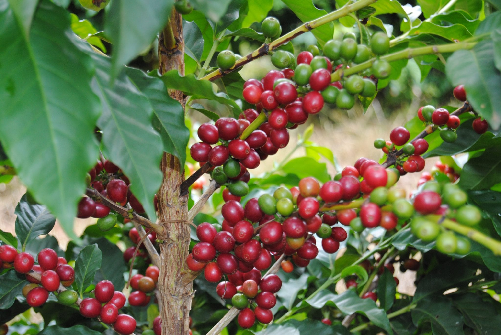
_ripe coffee berries_

Generally speaking, coffea robusta is considered to have a burned and bitter flavor profile. The tradeoff is that it has a higher caffeine yield and it's easier to farm. There's not much you can do with it in terms of quality coffee -- it's most often used in cheap coffee, and sometimes used in espresso to improve the crema. We'll assume we're not dealing with commodity coffee and focus on arabica coffee here.

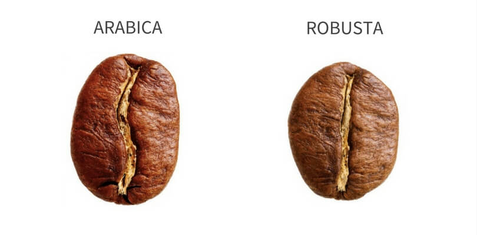

One interesting thing to note here, and which will be important later, is that caffeine itself is _not_ a tasteless chemical! It is bitter and astringent, and that has at least partial responsibility to robusta's bitter taste.

When the berries are ripe, they are picked and dried (often called "processed"). There are three main methods of processing:
  * Dry / Natural Process: we wash the berries and then leave them out in the sun. Once completely dry, the bean is removed mechanically.
  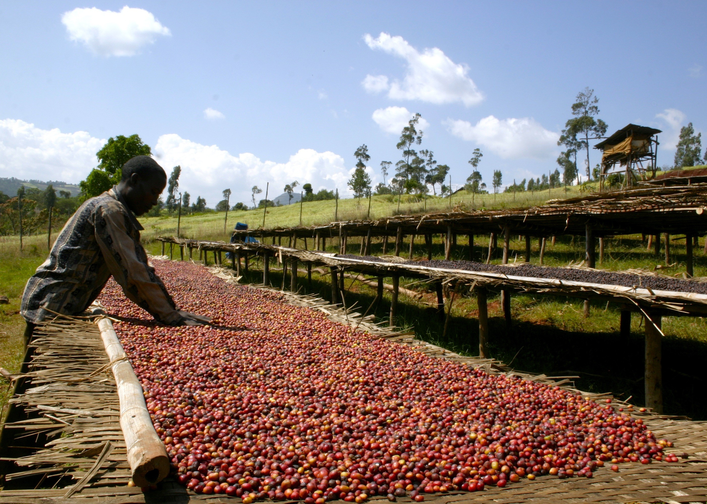
  * Wet / Washed Process: we immerse the berries in water, and remove the ones that float (as they are not ripe). The skin is removed mechanically, and the mucilage (pulp) is allowed to ferment in an enzyme tank. The fermentation eats the mucilage off the bean, at which point the seeds can be dried.
  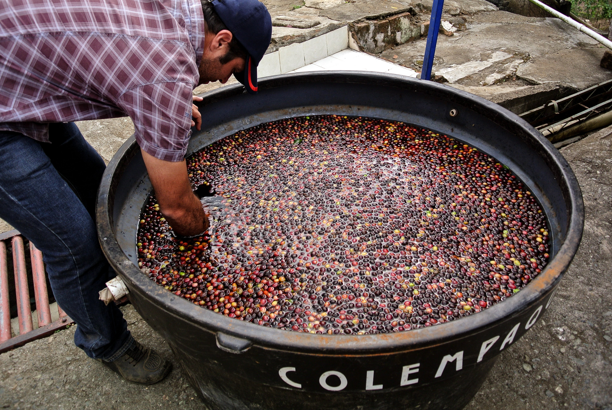
  * Honey Process: the skin is removed mechanically, but not the mucilage. The beans, still encased in mucilage, are left out to dry in the sun. This lets the mucilage ferment and dry on the bean itself. There are several "colors" of honey process (black, red, yellow, white): the darker the color is, the less often the beans are turned while drying. The amount of pulp left on the bean also tends to increase as the color gets darker. Turning the bean breaks up fermentation processes; thus darker colors have stronger fermentation flavor profiles like raspberry and citrus, and lighter colors tends more towards stonefruits and floral tastes.
  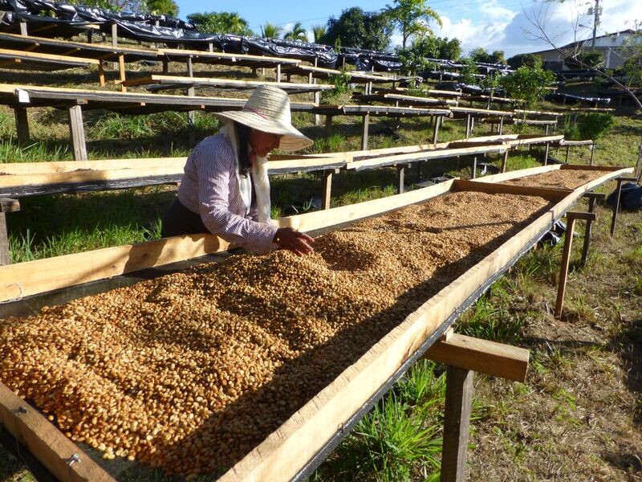

These processing methods have slightly different effects on the bean: wash-processed coffee is said to have very clean, acidic, and "transparent" fruity flavors, where naturally processed coffee has a more sweet, complex, smooth profile with a heavier "body". Scientific proof of what's going on exactly is pretty limited, but it seems as the time the bean spends in contact to its pulp helps add variance, as well as the fact that naturally processed coffee inevitably includes some under- and over-ripe berries.Honey processing has a bit of both; it retains the body and sweetness of the natural process while showcasing the acidity of a washed-process. It should be noted that processing is also heavily dependent on where the coffee is grown; for example, a honey process only works well in low-humidity environments.

<!-- 
Generally speaking, wet-processed coffee is considered to have the most "terroir". _Terroir_ is a term used in wine that refers to the entire environment in which the product was grown: the soil composition, temperature, altitude, climate, history of the soil, and so on. In  -->

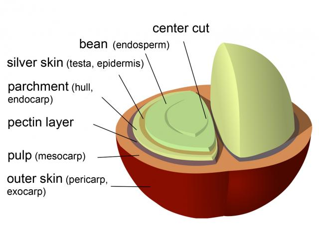

After processing, the beans are typically shipped off at wholesale prices to roasters. The roasters will then effectively bake the beans in a fancy combination oven/mixer. The end result is a cooked bean with color anywhere from light to dark. There's also a bunch of "named" roasts (American, City, Full City, Vienna, French, Italian/Spanish, in order from lighter to darker), but those are not often used anymore. A bad roast can really ruin even a great bean, so it's vital for the roaster to really know what they're doing. In general, lighter roasts are better for tasting the distinct characteristics of the bean itself -- similar to a steak, the more it's cooked, the more it tastes like what it was cooked on, and the less it tastes like the distinctness of the steak itself. The more the bean is roasted, the more flavors of smoke, chocolate, and vanilla will show through, and the less acidity in the cup. For this reason, poor-quality beans are often intentionally over-roasted (Starbucks is a primary culprit here) so that you get those nice flavors of roasted chocolate.

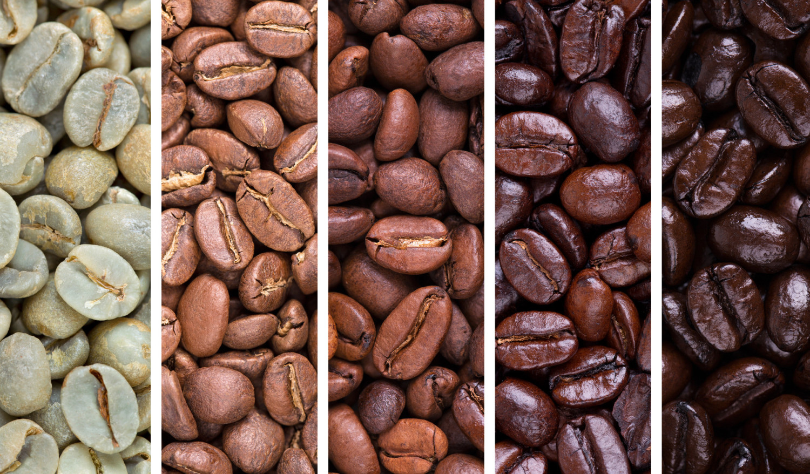
_unroasted, light, medium, dark, French_

The roaster then either packages up the coffee and sells it, or they ship it off to a resaler, who does the packaging and selling. At this point, oxidation is the enemy of good coffee, so the sooner it's in your hands, the better.

When buying coffee, there's a few key things to look for:
  1. How much you trust the seller's taste. I think there's a lot of validity here; if you've liked their coffee before, you're effectively buying in to their roaster's system and what they like. It's a reasonable starting point. If you're looking for good starting points, go to a cafe you like! Some "bigger names" that I like include: [Stumptown](https://amzn.to/34xRd0Z), [Intelligentsia](https://amzn.to/3dV9hVA), Tim Wendelboe, Chazzano.
  2. Roast date. Look on the packaging. Does it say "Roasted at ..."? If it says "Best by ...", don't buy it. The more recently it's been roasted, the better. If it's older than say, a month, you should look elsewhere; two months is definitely too long. Some people say that coffee should sit a couple of weeks before drinking -- I don't taste any difference there, personally. If you have a coffee shop you like, they likely sell coffee beans or ground coffee, and they likely are more fresh than what you'll find at a grocery store.
  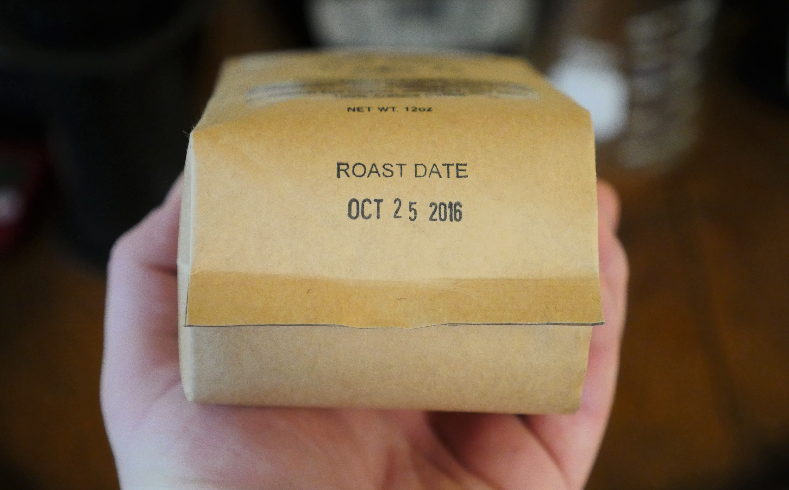
  3. Roast level. Like mentioned before, bad beans tend to be roasted darker to cover their distinctive features. That's not to say that you can't enjoy a dark roast coffee, but if you're buying expensive coffee, you'll probably get your best value at light or medium roast. Personally, the lighter the better, and there's some motivation to that later as I discuss brewing methodology.
  4. Grind. I'll go into this shortly, but the _best_ is if you have your own coffee grinder and buy the roasted whole beans. If you don't have a grinder, make sure to buy a grind that is appropriate for your brewing method. For example, a Chemex pourover requires a relatively coarse grind, while an espresso must be ground much finer. Look on the packaging for what grind the coffee is best for; if it seems to suggest effectively everything, for example, both drip and espresso, that's a red flag. If you're at a coffee shop, they usually have their own grinder and can grind beans to whatever specification you want.
  5. Oils. If you have a dark roast, you want to see visible oil on the surface of the beans. Oil comes out when the bean is roasted to a certain point, and eventually it will evaporate. A darkly roasted bean with no oil indicates that the roast was too long ago to use in a nice coffee. Note that this is relative to the roast -- you expect to see no oil at all on a light roast, and more oil on a darker roast.
  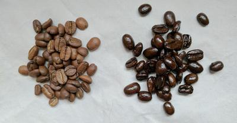

Alright, you're at home now and you've got a bag of roasted coffee beans. What now?

The first step on the consumer (that's you) end is to grind the beans. As mentioned earlier, oxidation is the enemy of a good coffee bean, and exponentially more so once the bean has been ground. That's why I suggest buying whole beans and grinding yourself; you can push the time in which the oxidation becomes particularly harmful to right before you brew. If you have a bag of ground coffee sitting around, you'll lose all the great flavors within a week, and the bag had probably been sitting on the shelf at the store for at least a few days.

If you don't have a grinder, you can skip this step and buy ground coffee, but I recommend you buy a decent coffee grinder.

When choosing a grinder, you want to make sure it uses burrs, not a blade. Burr grinders give you the better consistency, which is super important when you're dealing with decent coffee. They work by having two rotating steel or ceramic plates, set apart by a certain amount of space. As beans try to enter the space, they are ground up by the blades so that they can get through, resulting in a relatively consistent grind. Avoid blade grinders as much as possible. You have lots of options: the most important variable is that the grinder is consistent. Consistency is measured by how much variation you end up with smaller-than-expected particles (_fines_) and larger-than-expected particles (_rocks_). We want consistency to be optimal, because it allows us to play with other variables with confidence. An inconsistent grinder will sometimes make a great cup, sometimes not, and the end result will be a frustrating (and expensive!) experience as you "dial in" the grind. Not all grinders are automatic; there are some pretty good manual grinders on the market! The downside is that they take some manual labor (about 1 minute of arm workout per cup), but they're small and make a great cup of coffee. The [Hario Skerton](https://amzn.to/35BXlnU) is a very popular option. Apparently, it's used a lot for camping.

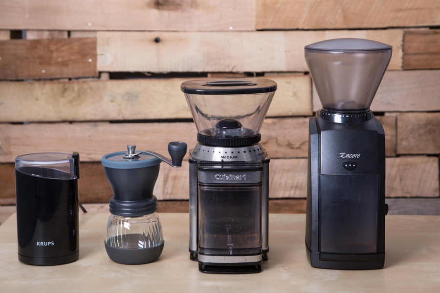
_Hario Skerton second from left; Baratza Encore on the right end_

I personally use a [Baratza Sette](https://amzn.to/3oyTfG7), and previously used a [Baratza Encore](https://amzn.to/2FYNDU1). I really highly recommend the Encore for people new to coffee -- it's relatively cheap and gets 90% of the way there. You can get decent grinders even cheaper, but this has that ideal balance of "great starting point" and "a high ceiling until you need to upgrade". Baratza is a great company for the engineering-minded because they design their devices to be repaired and upgraded by the owner, and I've greatly enjoyed popping my grinder open and playing with it.

Now that you've got a grinder, you'll need to grind your coffee in accordance to your method of brewing the coffee. Different methods demand different grind sizes; for example, a cold brew generally is best with a coarse grind. Why is this so? Let's _boil down_ (no pun intended) how coffee-making works to get an understanding of it. When water comes in contact with the ground coffee, some amount of coffee materials and oils dissolves into the water. The more surface area of the coffee touches the water, the more of that material gets into the water. Likewise, hotter water, more time in contact, and more agitation of water all result in a stronger coffee "essence" result. Note that grind _is_ the variable that directly corresponds to surface area that the coffee has -- a coarse grind has much less surface area as opposed to the same amount of coffee with a more fine grind. Similarly, this explains why consistency of grind is so important: if you have some pieces of coffee that have lots of surface area, and some pieces that have much less surface area, you expect very different results out of each of those pieces. The more uneven pieces you have, the harder it is to know what is signal and what is noise.

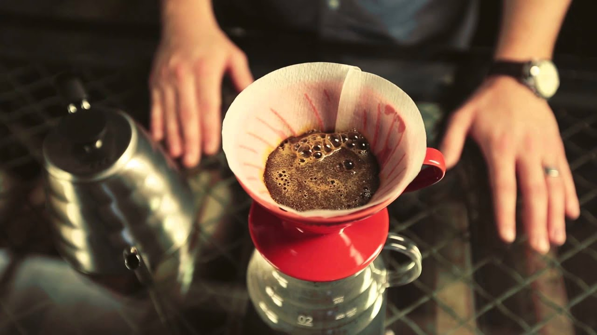
_v60 in use -- currently blooming_

I'm going to talk about making pourover coffee, which is the method I use the most at home. This is effectively the same as manually performing the task of a drip/filter machine -- hot water is poured onto a bed of coffee grounds, which make their way to the bottom, get through a paper filter, and collect in a carafe. The difference with pourover is that you're doing it yourself, so you have control of all of the variables, from water temperature to pour rate and stream consistency.

I mostly use the [Hario V60](https://amzn.to/31F9Yxo), but there are lots of alternatives. The V60 is a good choice because it's the most popular method of pourover. I also strongly recommend the [Chemex](https://amzn.to/35xi2Sb) -- it provides a very unique "clean" taste, it has an attached carafe, and it just looks fantastic. The Chemex is even featured in the Museum of Modern Art's permanent collection. It also makes a truly excellent iced coffee.

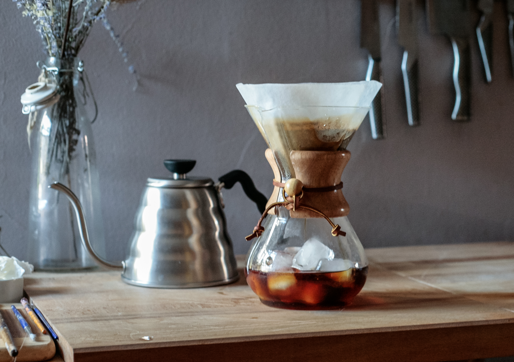
_the Chemex_

You'll also want some kind of kettle to pour water onto the grounds with. If you've already got one, great! I use a fancy [gooseneck kettle](https://amzn.to/3dWHHXZ), but you can use whatever you want. Having more control of where the water hits is nice, but really not _that_ important. You just want some way to get water onto the grounds, ideally in a manner where you can control the rate and temperature of the water. A tea kettle is honestly more than good enough here.

The last part you'll need is some kind of scale. We use the scale to, again, hold some variable constant so that we can experiment with other variables. You could skip this, but a scoop of coffee is not always the same amount of coffee, and it's hard to eyeball water. Having a scale, at least to start out, helps you get great coffee faster, and helps keep it constant. I use the [Hario V60 scale](https://amzn.to/3jqz6xX).

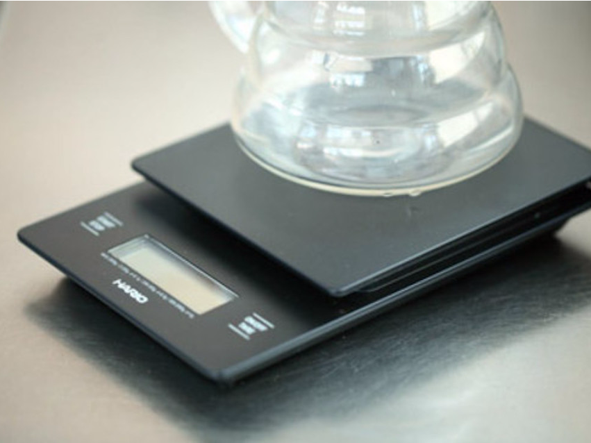

The V60, carafe, and scale [bundle](https://amzn.to/31F9Yxo) combines all of this together (minus the kettle), which is exactly how I started.

We now have all of the pieces we need to make coffee: coffee beans, grinder, pour method, kettle, and scale. When we're making a coffee the goal is to hold all but one of the variables constant so that we can compare differences incrementally. If we keep everything consistent, we can play with other variables and have confidence that our changes are actually the cause of changes. The variables that technically effect your ending result is basically infinite: water temperature, room temperature, coffee grind, atmospheric pressure where you're brewing, pH of the water you're using, etc etc. With that in mind, let's focus on the variables that are _easiest_ to control:
  * Temperature: I argue that the best temperature for light-roast coffee is "as close to boiling as you can get" (see later for more in-depth argument), which makes this particularly easy. Boil water, and use it as soon as possible to avoid losing temperature. If you're using dark-roast, or if you don't buy my argument that the hottest temperature possible is ideal, you'll probably want a lower temperature. In this case, use a thermometer and try to keep it as consistent as possible between attempts. Because everyone's got a thermometer, this is pretty simple.
  * Water: if possible, use purified water, or at least, water you like to drink. Regardless, use the same water every time. For example, you can't expect that the tap water at work and at home are the same, so the coffee is likely to be at least slightly different, even after boiled. For what it's worth, people say not to use distilled water, but it tastes fine to me.
  * Methodology: for each step, keep the time when done, amount of water, and method in which you pour your water as consistent as you can. In addition, because we value consistency, we also should value methodologies that make consistent results easy. For example, French Press is super-consistent because there's minimal human intervention. Likewise, where possible, high agitation is better than low agitation, as variation is reduced as agitation increases (consider pouring water straight down onto a bed of coffee vs pouring water across the entire bed).
  * Beans: each batch of beans has different physical properties, and so you can't necessarily compare one bag of coffee to another directly, holding all other variables constant. Instead, when we compare beans to each other, we optimize the grind for each bean, and only then can we compare those beans against each other.
  * Volume of coffee vs water: if we pour more water in than the previous experiment, it's reasonable to expect different results. Therefore, we want to keep the amount of coffee and the amount of water consistent. This is what the scale is for!

That leaves one last variable, which will be the variable we play with the most: grind size. Holding all of the above variables constant (or at least, as close as constant as we can), we play with the grind size in order to optimize the taste of our coffee.

Because we've done such a good job of holding other variables constant, we only have three metrics we need to assess:
  * Strength: if the coffee is too strong, decrease the volume of coffee to water; if the coffee is too weak, increase the volume of coffee to water.
  * Taste: if the coffee is too sour, your grind is too course; if the coffee is too bitter, your grind is too fine.
  * Flavors: this is entirely dependent on the bean. If your bean is bad, all a great pourover is going to do is make it taste _really_ bad and showcase all of the bad-tasting characteristics.

We also use the _drawdown time_ as a way to tell us if we're doing a good job of holding our variables constant. If everything stays consistent, the amount of time that it takes until all of the water gets through the beans and it is ready to drink should also be consistent. If it goes too long, this might indicate that our grind is too fine, and vice versa for if it goes too short. However, it's best to use your taste buds as the metric!

Note that there is a difference between sour and bitter. Sour is like citrus and fruit; it makes your mouth pucker, and you feel it on the sides of your mouth. Bitter is pungent and is more like dark chocolate or a hoppy beer, felt in the back of the tongue. It's common to confuse sour and bitter, but they are very different!

Generally speaking, we want a good balance between sweet, sour, and bitter in our coffee (salty and umami do not exist in appreciable amounts). Where the balance sits is up to you, but it should be noted that needing sugar and milk to cut back on a bitter cup means you don't have a good cup of coffee. I think a coffee can be _even better_ with milk and sugar (some people strongly disagree with this), but at bare minimum, it should be drinkable by itself. It's kind of similar to a whiskey -- if it's no good alone and only tastes okay in a cocktail, you probably shouldn't use it in a cocktail to begin with. It's similar to the saying, "only cook with wine you'd drink". Yes, you can get away with lesser wine, but is it worth it? In the end, what a good cup tastes like is up to you.

It's worth noting that as you get farther from the bean growing itself, the importance of that stage of production seems less important. For example, a great barista can't make a terrible coffee bean taste any good. This is somewhat different from other disciplines; a great mixologist can make a great drink out of several bad drinks, but coffee is effectively a game of decreasing quality at each stage. The best coffee is therefore just the production that has been decreased the least. In my opinion, in order from most important to least:
  1. Bean quality
  2. Roast
  3. Grind
  4. Brew method

At each of these stages, any step can totally ruin the coffee. For example, a very dark roast completely covers any of the distinctive flavors of a great bean. Your goal, wherever you sit in the list, is to do the coffee bean justice by allowing its process to shine through in the cup.

In this section, I'll discuss a few random things that I think are worth bringing up.

I earlier argued that boiling water is the best choice; I picked this up from James Hoffman and after experimentation, agree with him. First, it is indisputable that boiling water makes it easy to keep the "water temperature" variable constant. That is a _huge_ plus in my book, as each variable is multiplicative. Let's say I want to use water temperature as a variable. I brew my first cup at say, 5/10 grind and 205F water and decide that the coffee is too sour -- what do I do? I could either raise the grind, or increase the water temperature, but those variables are interrelated. And pragmatically, holding temperature constant is quite difficult unless you have a fancy kettle like mine. More objectively speaking, there is no credence to the idea that boiling water "burns" coffee beans. What happens when people say that they got burned coffee is that they are actually too much in a bitter cup -- the hotter water dissolves more from the bean, and at some point into the bean, that taste is undesirable. This particularly happens with darker roasts, as they have toasty tastes to begin with, and that adds up to something you probably don't enjoy. Instead of lowering the temperature, to reduce dissolved solids, you can grind more coarsely; by doing this, you get the same result out but hold a variable constant. One last point: the outside of the bean, before being ground, is the best part of the bean. Because of this, it is better to get more of larger chunks as opposed to getting less of smaller chunks -- the surface area of the outside is comparatively larger, and so you get a higher ratio of the better portion of the bean. This is particularly true in honeyed processes because of the fermented material on the surface of the bean.

Many pourover recipes tell you to "bloom" -- this means that you pour a certain amount (usually about 2x the amount of coffee) on the grounds, and then wait some amount of time (usually 30-45 seconds). What happens is that the carbon dioxide in the beans are getting released; by blooming we avoid releasing the CO2 into the water mix where it will end up in the coffee mixture. CO2 combines with water to form carbonic acid: a sour, unpleasant taste that you'll have experienced if you've tasted flat seltzer. In addition, the amount of CO2 in the beans is another indication of freshness: as beans age, CO2 is increasingly released. Therefore, if you get lots of bubbling when you bloom your coffee, it's a great sign that you've got fresh coffee that was properly stored.

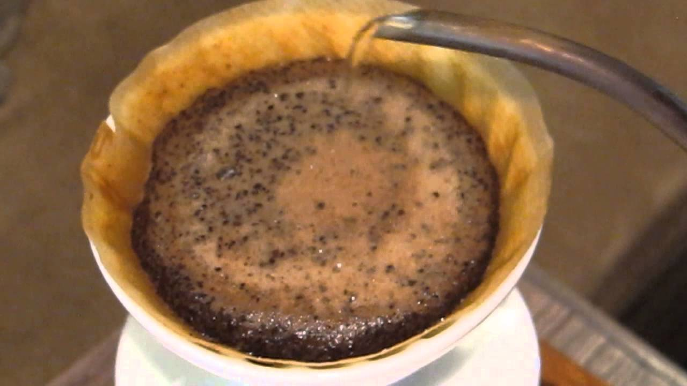

Pre-wetting the filter paper -- many people say that you want to rinse your filter with water before putting the coffee in. The theory here is that it removes a "paper taste" from the resulting coffee. In blind taste tests, I could not detect this paper taste in bleached filters, but could taste it in unbleached/"natural" filters. Possibly a better reason to pre-wet your filter is that it helps the filter stick to the edges of the cone, making it easier to avoid accidentally pouring water outside of the filter.

Finally, on to the recipe I use. There's tons of recipes out there; I do something very similar to Hoffman's recipe.

Ingredients:
* Water: 500g off the tap
* Coffee: 32.5g; light roast. Grind size 12/40 on the Encore

Steps:
1. Heat water to boiling
2. Pre-wet the filter, dump out the water
3. Put in the grounds, shake the cone to even out the bed
4. Make a little divot in the middle. This helps the water get everywhere during bloom
5. Start timer. Pour in 2X the amount of coffee. Shake the cone to try to get the water to touch everything
6. At 0:45, pour in circles until the scale reads 300g. You should end at 1:15. The goal is to agitate the grounds as much as possible, and to fill most of the cone.
7. At 1:15, pour very slowly right down the middle until the scale reads 500g. You should end at 1:45. The goal is to  agitate the grounds as _little_ as possible, and to keep the cone topped off.
8. As soon as is safe, swirl the cone.
9. Let it draw all the way down. Finish time is 3:00.

To make iced coffee:
* 400g of ice, put in the carafe beforehand
* 600g of water
* 70g of coffee
* Do everything exactly the same as before; note that drawdown time will be longer because you have more coffee and more water.
* Swirl the coffee in the ice. If you did it right, you'll have just a tiny bit of ice left in the carafe that won't dissolve easily.
* Pour the coffee into a cup filled with ice and a splash of half & half (iced coffee needs milk, sorry purists!)

TL;DR: a great starting point:
* Coffee: [Stumptown](https://amzn.to/34xRd0Z); [Intelligentsia](https://amzn.to/3dV9hVA); your favorite local coffeeshop's whole bean coffee
* Grinder: [Baratza Encore](https://amzn.to/2FYNDU1)
* Pourover Cone, scale: [Hario V60 bundle](https://amzn.to/31F9Yxo)
* Kettle: [Hario kettle](https://amzn.to/3oz8y1x)

_Disclosure: this content uses referral links_
