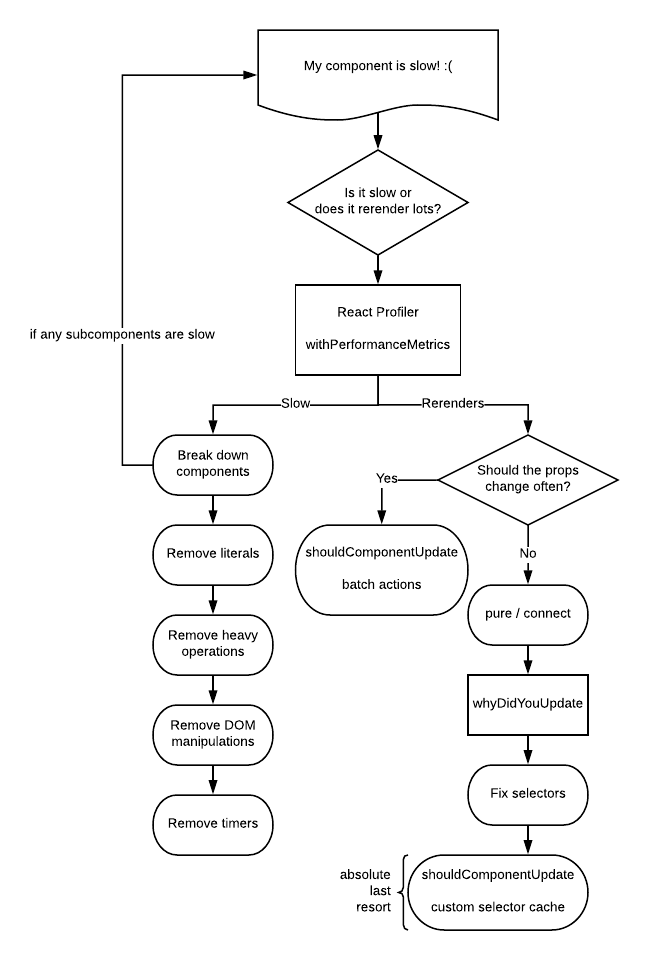

_(`withComponentMetrics` has been replaced with React Profiler)_

#### Why do components update?
In React, components update when a value in prop or state changes. When this happens, the component itself runs the render cycle. First, it generates the VDOM and diffs it against the existing VDOM. This step is called _rendering_. If it's different, it performs a _commit_ to the actual DOM itself to change those locations. When a component receives a re-render trigger, it first checks against its `shouldComponentUpdate` function. This function tells React if it should actually test if the VDOM is different. By default, this function always returns true, so it will always run. When React runs the render cycle, it propagates the update trigger down the tree of components, which each repeat the whole thing again.

#### shouldComponentUpdate
Because the render process is expensive, we want to limit the number of times that components receive render triggers. That cuts off the most expensive part of React earlier on, letting it focus only on areas that you know might need updating. The best thing we can do is avoid changing props that are send to a component, but that's not always possible. The next best thing we can do is use `PureComponent` – this implements `shouldComponentUpdate` as a shallow equality check of new props vs old props, and returns true if any of the prop references are different. By doing this, components can tell React that it doesn't need to bother checking it, and thereby avoid checking for that components and all of its children down the DOM tree.

You can also implement your own `shouldComponentUpdate`, but because that needs to be maintained along with the code itself, it should be reserved as a last resort option. For almost all cases, implementation of deep equality would work, but that would be slow and missing the point – we should be able to rely on shallow equality, with very few (if any) exceptions.

Note that shallow equality in JavaScript means that primitives (strings, numbers, etc) are compared by value, but objects and arrays are compared by their reference. It's the same as `a === b` in JavaScript.

Note that literals (`[...]`, `() => ...`, `{...}`) and React components are always new references.

#### Connect and Selectors
If you're using Redux, you're likely using `react-redux` for access into application state. The `connect` HOC that you use to do so actually automatically applies `PureComponent` by default – this means that connect locations are particularly interesting from a performance perspective. If we ensure that all props passed to the component and all props supplied by `connect` return the same _references_ (except when the data actually changes), the component won't have to needlessly re-render. It's important to note the importance of it being the same reference -- the same _value_ won't suffice.

#### `makeGet` Pattern
In the Redux world, it's very common to also use `reselect`, a library which memoizes selectors for higher performance. A commonly overlooked nuance is that by default reselect only sets up a cache size of 1 per selector. Because of that property, we need to be sure to maintain that 1:1 property in how the selectors are used. For example, if we pass `ownProps` to a selector, we need to make sure that those props always are the same for that selector.

In some examples, we want to create N items that use the same selector. If you have several repeated similar products, you _could_ select on the entire array of products and pass each product down to each component, but if any of the values of the products change, the entire reference changes, meaning that the component that owns all of the products needs to re-render. Instead, we have to select on the IDs of the products and pass that ID down, then in each component select that product. This works well, except since selectors only have one item caches, we either need a unique selector for each item, or we're constantly getting a new input value as we iterate over the arrays (in other words, always a cache miss).

To fix this, we have the `makeGet` pattern. If a `connect` is given a function, it runs that function for each instance of the component – we can use this to create a brand-new instance of the selectors we'll need in a closure, which is then inherently unique to that instance of the component. Make sure to remember that this pattern needs to be followed all of the way up – if we do `makeGet` selectors that have a sub-selector which takes different inputs, that selector will update, which means that all of the selectors that use it need to update, and that continues all the way down the chain.

#### Testing
When you make changes, especially to selectors, make sure to add unit tests. Tests will assure that our code works properly, and prevent them from breaking in the future.

#### React Profiler
React Profiler is a tool that runs performance tools for all components in a nice UI. It is included with the React Chrome extension. Unfortunately, you can't get these metrics on initial page load – the page has to mount, and only then can you start recording. To accomplish this, wait for the page to load, click record, then do anything that will cause your components to update on the client side. For example, you can hide the component behind an `if` statement, click record, and then flip the `if` statement off; you can perform an action like a client-side page route; etc.

The following performance metrics are collected (though the way it is visualized may differ):
- Number of times that phase (mount or update) has happened
- Actual time (time spent calculating changes; tells us how good our memoization is)
- Base time (time spent in render, tells us how heavy the component is)
- Start time (when React started working on the component)
- Commit time (when React finished working on the component)

At the top of the screen, Profiler displays how many commits occurred, as well as how intensive they were (orange is most, blue is least). You can organize the display by the render tree itself (flamegraph) or ranked in order from most impactful to least. If you click on an item, you'll get information about that commit, including props and performance metrics. Lastly, if you double-click on an item, it will show every time that specific component has been committed. Clicking between the commits may give you hints about why the component was told to re-render in the first place. We can use the amount of times a component updates or mounts to debug re-render issues, and we can use the timing metrics to debug both how performant the component itself is, and how performant it is including memoization.

#### `whyDidYouUpdate`
`whyDidYouUpdate` is a tool that runs a deep equality check of new vs old props automatically for all components. Whenever a component receives a re-render trigger, if the props are the same by deep equality but the component is being told to update anyway, that means that it is a wasted render cycle. We can use that indicator to fix the associated parent or selector that is causing the problem, or to apply a `shouldComponentUpdate` to that component.

For clarify, `whyDidYouUpdate` tells us when renders occur; React Profiler tells us when commits occur. Both are valuable tools.