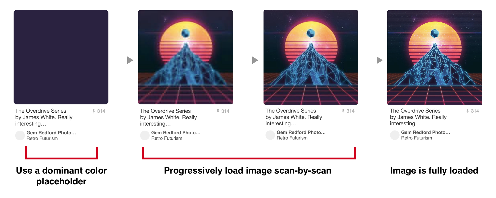
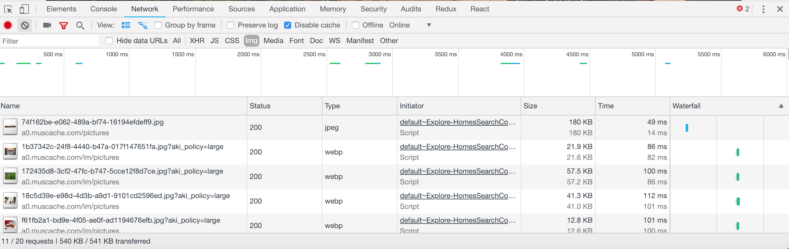
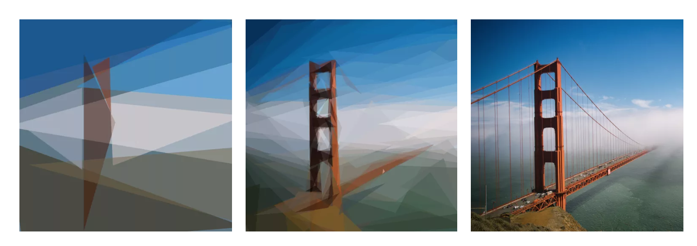

For better or worse, many of the biggest performance gains in front-end engineering regard lowering network payload, and the biggest payloads are from rich media -- particularly video and images. I've had a decent amount of experience in optimizing image-heavy websites, and a few strategies have emerged as particularly effective.

## Relative Sizing
This may seem obvious, but by far the best thing you can do is size your images only to the size that's needed. For an actual example that's happened, having a 2400x2400 image that fits in a 150x150 slot is a huge waste of bandwidth. Even with aggressive compression, this is easily the best way to reduce your bandwidth footprint. Therefore, for a 150x150 slot, take the time to export a 150x150 image. Even if it's losslessly compressed, you'll save bandwidth.

The problem is compounded a bit when you consider that screens have different _pixel ratios_. A pixel ratios is a ratio between the physical pixels of the device and CSS pixels -- these are not the same! For example, my MacBook Pro has a pixel ratio of `2.0`, but an iPhone X has a pixel ratio of `3.0`. This means that if I place a 100x100 image in a 100x100 slot, it'll actually appear blurry on these devices! Therefore, I recommend building a utility that dynamically pulls the correct image for the device. Your utility will look something like this:

```
const getImageSize = (initialSize) => {
    const { devicePixelRatio } = window;
    const ratio = Math.round(devicePixelRatio || 1);
    const boundedRatio = Math.ceil(Math.floor(ratio, 3), 1);
    return initialSize * boundedRatio;
};
```
_(Pixel ratios are decimal, but I clamp and round the value to make it easier to deal with)_

Now, if you make sure you have the 1x, 2x, and 3x versions of each image available (for example, for a 100x100 slot, you have 100x100, 200x200, and 300x300 available), you can present the correct image at any given time:
```
const imageSrc = `${baseUrl}x${getImageSize(100)}`;
```

By doing this, you will only have the device download the appropriate size for itself. I even recommend that you build this into your image pipeline: have it export all three sizes in a consistent manner and hide the `getImageSize` functionality behind your app's image component. If you build this deep into your pipeline, developers won't ever have to think about pixel ratios, and you'll automatically get the advantages of a correctly-sized image on a per-device basis. You can also use `srcset` for this functionality!

## Exact Sizing
When a browser receives an image, it tries to place it in the DOM element that asked for it (ie. the associated `img` or `div` tag). If the image is too small or too big for the size of that element, it will have to compress the image down into the right size so that it looks correct -- this process is called _resampling_. This compression stage is CPU-intensive and can really dig into your site's performance. Even worse, this resizing counterintuitively  makes your images much more blurry -- a 101x101 image in a 100x100 slot will look much worse than the 100x100 equivalent. Therefore, whenever possible, pull down the exact size of the image needed. Sometimes that requires a redesign for your page, for example if you have a design that asks for images at 25% width, but the advantages are clear. You'll notice a big advantage in both performance and image clarity.


Note how [Amazon](https://www.amazon.com) pegs the image height at 200 pixels so that it can serve the exact-sized image.

## Compressed Images
This probably comes to no surprise for most people, but an effective compression algorithm can save you a ton of bandwidth. In the experiment below by KeyCDN, we can see the tradeoff of increasing compression artifacts vs much lower file size. It's typically up to your product team to decide where that tradeoff should be made, but you should generally push for compression as aggressive as possible.


## Image Formats
There exist newer compression algorithms, such as Google's WebP, JPEG 2000, JPEG XR, and so on. These tend to produce smaller files with better compression, at the tradeoff of slightly higher decoding time. Unfortunately, browser support is inconsistent at best for these new formats, and no one format has emerged as a clear winner. The best solution in the meantime is to use the `<picture>` tag or `srcset` to conditionally supply the best image for the browser.

## Progressive JPEGs
Instead of downloading the entire image at full quality, a progressive JPEG downloads incremental "scans" of the image, making the image appear to load faster and giving context while the image is loading. While the overall network bandwidth isn't reduced, the user's experience is significantly improved by the faster image appearance. Below, Pinterest's progressive JPEG loading is shown (source via the highly recommended [Essential Image Optimization](https://images.guide)):



#### Automating Your Image Pipeline
To combine all of the points above, the best thing you can do is _automate this process_. Get it to the point where you just don't need to think about all of this stuff, so it can't be messed up. There are plenty of resources that will handle the whole process for you -- [Cloudinary](https://cloudinary.com/) is my favorite. If you need more control of the process, there are utilities out there that will manage each step of the process. See [Essential Image Optimization](https://images.guide) for in-depth suggestions.

One important note: be careful to ensure that you _always_ start with a lossless file! In other words, start from the highest resolution file that you have access to. You don't want to compress an already-compressed file; the compression will be less effective and introduce more compression artifacts than if you started from the raw image itself.

## Lazy Loading
Depending on where it's located and its importance, you may not even need to load every image on the initial page load. This is typically called _lazy loading_ -- the idea being to display something in the place of the image to allow the user to see the page immediately, then replace the placeholder with the actual image when the time is appropriate. The placeholder can be literally nothing, a smaller image, or a CSS effect. [Facebook](https://www.facebook.com) did this to great effect: on initial load, a user's profile shows their cover photo compressed to 200 bytes. This means that the user will immediately see a blurry version of their photo, which will then be replaced with the full-quality version once it finishes loading in the background.


Another approach is to wrap the image in an _intersection observer_ -- simply a utility that sends an event when an element is scrolled over. By doing this, you can replace an image with a placeholder and then only load the image as the user scrolls over the image (or gets close to scrolling over it). The tradeoff is that the image isn't there yet if the user scrolls quickly over it, but that's often worthwhile considered against the cost of downloading an image that isn't immediately needed. Intersection observer is valuable when you can afford for the images to not be there when a user scrolls across.

It's important to ensure that you pegged your image heights to a specific value (see the section on Exact Sizing above), so that your placeholder is the same exact size as your real image. If it's not, as the user scrolls, they will notice elements moving up and down the page. In addition, you will incur a performance penalty due to requiring a regeneration of the page's layout.

[Airbnb](https://www.airbnb.com/) uses Intersection Observers to download images before you're about to scroll over them:


## SVG Pre-loading
On the cutting edge of pre-loading is utilization of SVGs. Because SVGs are simply coordinates for shapes, they are much smaller than any other file size, and they also can scale perfectly to any size or any pixel ratio. Their downside is that they need to represent their information in terms of pure shapes (ie. a red circle centered on this point, a blue triangle with these points, etc), but that abstraction can actually create a beautiful loading effect.

Seen below, the Primitive library approximates an image into a given number of shapes (10 shapes on the left, 100 in the center, the original on the right).


_(via [José Pérez](https://jmperezperez.com/svg-placeholders/))_

This approximation effect can be downloaded very quickly to the client and displayed while the actual image is still downloading. Using this strategy, the reader gets a good idea of what they're looking at, but also is not stuck waiting for the entire image to download in order to move forward in consuming the page.