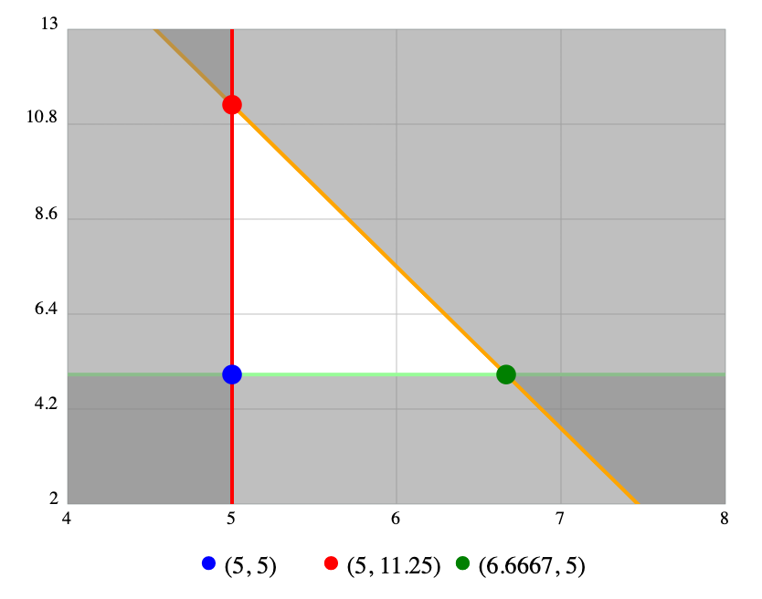

If you're a football (the _real_ kind, not soccer) fan, you're well-aware of the yearly schedule release. At some point between April and August, the regular-season schedule for each of the 32 teams is released. Fans and pundits immediately begin analyzing it and making predictions about the upcoming year, and the [95 billion dollar football gambling industry](https://www.ibtimes.com/legalized-sports-gambling-americans-bet-95-billion-nfl-college-football-season-mostly-2089606) is officially kicked off. What you might not have thought about is how computation goes into making those schedules a reality!

Let's talk about what needs to happen in an NFL team's regular-season schedule. First, note that the NFL is split evenly into two _conferences_: the American Football Conference (AFC) and National Football Conference (NFC). Each conference has 16 teams (half of the total 32 in the NFL), which are then each split evenly into four _divisions_: North, South, East, and West. Each division, therefore, has four teams in it.

A team's NFL schedule must have the following properties:
- Six games against divisional opponents - two games per team, one at home and one on the road.
- Four games against teams from a division within its conference - two games at home and two on the road.
- Four games against teams from a division in the other conference - two games at home and two on the road.
- Two games against teams from the two remaining divisions in its own conference - one game at home and one on the road. Matchups are based on division ranking from the previous season.
- One bye week (no game) between weeks 4 and 12.

There's even more that makes this extra complicated:
- A team with an early bye week one year will receive consideration for a later bye week the next season.
- Teams scheduled to play on Thursday nights will not have to play on a short week more than once a season.
- On Week 1, the reigning Super Bowl champion plays at home to kick off the new season.
- A team should not play more than two consecutive away games.

...there's plenty more, and this is just talking about scheduling the match-ups themselves, and completely ignores all of the work that goes into time and date scheduling!

From a human-work perspective, this is immense! Each week, there are `32 choose 2` possible combinations (it's not 32<sup>2</sup> because it's a combination, not a permutation), for a total of 496. That's compounded on each week, so we have 496<sup>17</sup> theoretical schedule possibilities for a year. Even if our program somehow only takes 1 microsecond to calculate, it will take literally forever (much, much, _much_ longer than the lifespan of the universe). How do we handle a problem on this scale?

Luckily, there's a whole branch of mathematics that's perfect for this kind of problem called _linear optimization_ (or linear programming, if you like). The idea is that we create constraints, which define what must happen in order for a solution to be considered, given some input data. That will create a space of possible solutions, and then we can analyze only the possibilities that are actually feasible. We'll use a simple example problem to explain how it works, and then we'll show how the NFL uses it to help them schedule.

Imagine you have the following problem: you own a restaurant, and you want to figure out how much to prepare for the upcoming day. You have 4 hours to prepare. You have a pizza, which costs $4 and 30 minutes to make, but sells for $15, and you have a hamburger, which costs $5 and 8 minutes to make, but sells for $9. We need to have at least 5 of each prepared. How much do you make of each to optimize profit for the day, assuming that people just buy whatever you've prepared?

You could solve this conventionally with algebra, but let's take a linear optimization approach. First, set your variables:
```
P = profit
x = number of pizzas prepared
y = number of hamburgers prepared
t = time
```

We have some constraints, converted from the word problem into math:
```
x >= 5; y >= 5 (we have to make at least 5 of each)
t >= 240 (we have 4 hours to make it)
t = 30x + 8y (it takes 30 minutes to make a pizza, 8 minutes to make a burger)
```

Now, we'll solve `t` for `y`, which gets us `y = (240 - 30x)/8`.

With these functions, we can now plot them on a graph, as you conventionally would:


Notice how the set of constraints we defined create an area -- we call that the _feasible region_. Anything in this area is a solution that would be acceptable given the constraints, but not necessarily optimal. Now that we have this, we'll define our optimization equation. In this case, we want to optimize profit:
```
P = 15x + 9y
```

All we have to do now is take each _vertex_ (each corner, shown by dots in the problem) and plug their `x` and `y` values in. The highest value wins! In this case, we find that the best we can do is 5 pizzas and 11 hamburgers, netting us a total of $176.

While this result isn't particularly mind-blowing, it shows how we can use a linear perspective to view our data in a new light, then use an optimization function to decide what _in a set of potential answers_ is the best of them. Let's jump back to the NFL to look into a little more.

Like before, we're going to have to set up our constraints. In this example, we actually have our constraints already defined for us under the "must have..." list above! For example...
- You must have exactly six games against divisional opponents
- You must have exactly two games against each divisional opponent
- You must have exactly one home game against each divisional opponent
- You must have exactly one away game against each divisional opponent
- You must have no more than two away games in a row

If you imagine that each of these constraints are yet another line on a multi-dimensional graph (since now we have variables for all 32 teams in the NFL), you can see how this will form the multi-dimensional equivalent of a feasible region. In other words, we're adding additional dimensions, but we can still think about the solution set as a feasible region.

At this point, we have a relatively limited number of acceptable solutions in our feasible region (each vertex within the multi-dimensional plane). The amount of possible answers depends on how the constraints are set up, of course, but it seems likely that there are a reasonable number of them, likely enough for a human to manually look through (or at least, to run other programs over for quantification). In addition, because we know every schedule is compliant with our constraints, we can use concepts that are hard to quantify, like "gut feeling".

That said, in the interest of moving this concept over the goal line, let's try to find a mathematically optimal solution. Similarly to before, we'll need to check each vertex against an optimization equation, which is just a function run over each vertex in our feasible region. In our case, perhaps we'll optimize for teams with close records, to make the games interesting. We might need a secondary optimization equation, in case multiple schedules are tied, but we'll likely come out with a single schedule -- the new schedule for the entire NFL.

In real life, the NFL [does something like this](https://www.gurobi.com/pdfs/case-study-NFL-English-low-res.pdf) using Gurobi (a library for linear optimization), lots of secret constraints, and a healthy amount of human checking. Linear optimization is also heavily used in other scheduling problems (like school classes) and in multivariate analyses.