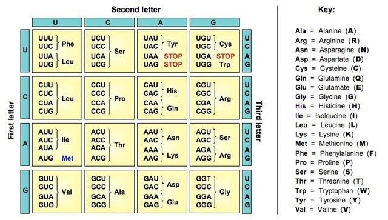

I've had a strange relationship with biology. My father is a chemical engineer, and he did a great job of instilling interest in the sciences... but it just never "clicked" academically. I didn't do well in chemistry or biology in school, despite my interest in it. In hindsight, this is surprising: similarly to computer science, biology is heavily dependent on abstraction and systems thinking.

I recently joined [4Catalyzer](https://4catalyzer.com/), which operates in the intersection between biology and computer science. I actually turned down offers from Google and Facebook to come here, and I haven't regretted it. It's been a great experience, and the mission is super compelling.

You may be surprised to know how interrelated computers and biology are. In particular, DNA "data storage" and production data storage are remarkably similar.

When you send a piece of data to the cloud (for example, uploading a file to an email or syncing your phone with Google Photos), it is typically saved on multiple hard drives simultaneously. In the most simple case, we simply have duplicated data on two drives -- this is also known as RAID1. For any given sector of a hard drive, if it fails, we haven't lost anything because we can just use our backup. This happens surprisingly often -- an average hard drive lasts [about six years](https://www.backblaze.com/blog/how-long-do-disk-drives-last/).

<!-- But what happens if _both_ drives fail for the same data? You've now permanently lost your data. For this reason, production computer storage systems often operate on RAID3, RAID5, or RAID10, where the data is duplicated onto 3, 5, or 10 drives. Even if multiple drives fail, you can still recover the data if at least one drive is still valid. -->

DNA has a similar problem: mutations can occur through reproduction or from radiation. DNA is coded as a series of different nucleotides: effectively, data encoded in base 4. In other words, there are four possible nucleotides (adenine, cytosine, guanine, and thymine), and the series of these nucleotides forms the genetic code for all living things. In computers, this is the same as computer storage's binary encoding (two possible values: 0 and 1) that form the information for all computer data.

Like a sector on a hard drive failing, a single bad mutation can be disastrous. The most commonly-cited example of this is when a mutation changes a `GUG` codon to a `GAG` codon, causing sickle-cell anemia ([source](https://oncohemakey.com/genetics-and-pathophysiology-of-sickle-cell-anemia/)). This is all due to a single nucleotide mutation.

To "prevent" this from happening (on an evolutionary scale -- I'm sure the actual science behind this is much more complicated), DNA isn't read linearly from the nucleotide level. Instead, three nucleotides form a codon, which is then read in. Because there are 64 possible combinations of nucleotides (4^3) and only 20 natural codons, each triplet pair inherently has built-in replication. A mutation can occur, but it's decently likely that the mutation will still land on the same end result.

 