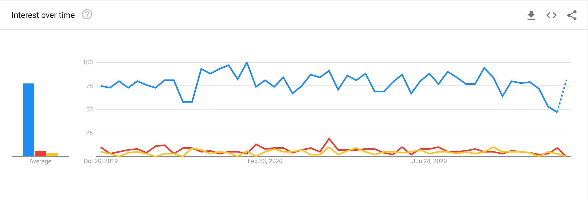

Apollo is a company which provides a nicely-written and open-sourced client and server combination for GraphQL. As of this writing, it is by far both the most popular GraphQL client and the most popular GraphQL server.

Much of this interest is likely due to excellent marketing, and a reasonably good library. However, for whatever reason, one of the biggest tradeoffs of adapting Apollo is very difficult to find online. So, here it is.

One of the big value propositions in Apollo is that it can traverse the React tree via the function [`getDataFromTree`](https://github.com/apollographql/apollo-client/blob/master/docs/source/api/react/ssr.md), and as it does so, it builds a single GraphQL request to send to the backend. The idea here is that you send a single request to the backend and upon response, the frontend can all be displayed immediately, because there's no need to wait for a component to be rendered in order to send the fragment associated with it. This lowers latency time, and frees up your limited available active connections.

However, in reality, this _must_ double your render time. Apollo has to recurse down the entire DOM tree, building up the GraphQL request next to it; and in order to do that, it calls React's `renderToStaticMarkup` function. Therefore, while you can expect an improvement in network load, you can also expect a doubled render time. For most sufficiently complex apps, it is likely that the end result is a _longer_, not shorter, time to a usable app experience. It's up to you to check which way wins; if your render is short enough, Apollo is a great fit. Otherwise, I suggest you avoid cargo-culting in general. Apollo is a reasonably good client, and a very good server, but like everything, it has tradeoffs. You can also turn off the `getDataFromTree` step.

For whatever reason, this seems to be a pattern with certain new "sexy" technologies: Apollo, Cypress, and Serverless all are almost entirely ubiquitously described as Good, with no possible tradeoffs outside of being complex. Daniel Kahneman's [_Thinking, Fast and Slow_](https://amzn.to/33Wy3kL) (highly recommend) describes this common fallacy as part of confirmation bias -- the brain is quickly able to build a story where the product is entirely good, and therefore there is no need to expend mental resources on the alternatives, or on analyzing exactly how this product works. Whenever something seems like there are no downsides, one should immediately be wary that cognitive bias is getting in the way of objective decision-making.

In addition, this falls into a pattern I've seen increasingly as I get more experience in software -- technologies that work well as a demo or in a small personal project tend to take off, but aren't necessarily good at enterprise scale. This is likely a product of the way the Internet works, coupled with another fallacy (again, well-explained in _Thinking_): when faced with a difficult problem, the brain tends to replace the question at hand with an easier question. In this case, it's likely that the question "what is the best GraphQL client for my company?" is replaced with "what GraphQL client have I used the most?" or even "what GraphQL client do people in general seem to use?". Because there are countless tutorials and articles written about the popular, easy-to-use technologies, the choice of Apollo seems obvious. This problem even compounds upon itself; as more people write about Technology X, more people see it as the ubiquitous option, and themselves use and write about Technology X. How good it is against the opposition doesn't really come into play anymore, because the question has been substituted with a popularity fallacy.

For what it's worth, in my current job, we use Apollo Server, but not the client. If you're using GraphQL and care about client-side performance, I suggest [Relay](https://relay.dev/). It pre-compiles your fragments via a clever system such that you get _most_ of the "single request with everything you need", without the doubled render time. If you're on a simple system, I suggest [urql](https://formidable.com/open-source/urql/), or just using the built-in `fetch` function. You don't necessarily need a GraphQL client at all!

_Disclosure: this content uses referral links_
